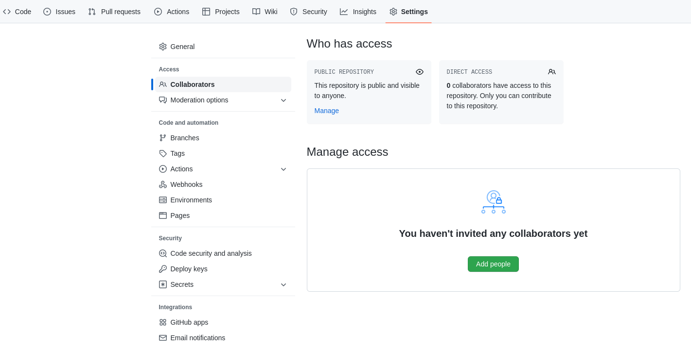

# Roteiro para uso do Git e GitHub

## Setup inicial

1. Criar uma conta no [GitHub](https://github.com/). [O que é GitHub](https://pt.wikipedia.org/wiki/GitHub)?

2. Instalar o git no seu computador seguindo os passos disponíveis nesta página: [https://git-scm.com/downloads](https://git-scm.com/downloads). [O que é Git](https://pt.wikipedia.org/wiki/Git)? 

## Criando o primeiro projeto

1. Criar um repositório na sua conta no GitHub em [https://github.com/new](https://github.com/new). Você vai dar um nome para o seu projeto e clicar em *Create repository*. Depois disso uma tela irá aparecer te mostrando algumas opções para o setup do seu projeto. Você pode, por exemplo, criar um novo repositório a partir de arquivos existentes na sua máquina: 

````bash
git init
git add README.md
git commit -m "first commit"
git branch -M main
git remote add origin https://github.com/fbarth/roteiro_git.git
git push -u origin main
````

Neste momento, você vai ver que todos os seus arquivos que estão no diretório local agora então na URL informada acima. Basta dar um refresh na URL acima. 

2. Você também pode adicionar novos arquivos ao seu projeto na sua máquina local e ver o status dos arquivos modificados:

````bash
git status
````

3. Você pode adicionar estas modificações em uma *staging area*, dizendo para o git que no próximo *commit* ele deverá considerar tais mudanças:

````bash
git add .
````

4. Você pode fazer o *commit* e *push* para o repositório remoto: 

````bash
git commit -m "estrutura inicial"
git push 
````

Podemos fazer estas etapas de *add*, *commit* e *push* inúmeras vezes. O GitHub irá manter todas as versões dos arquivos. Além disso, se for necessário, podemos baixar todo o projeto em uma outra máquina fazendo o *clone* do mesmo: 

````bash
git clone https://github.com/fbarth/roteiro_git.git
````

Percebam que a URL informada acima é a mesma informada no item 3. Quando você for fazer isto com o seu projeto você terá que informar a URL do seu projeto. 

## Compartilhando o projeto com outros desenvolvedores

Ok! Agora está na hora de compartilhar o projeto com outros desenvolvedores. Para isto, basta ir na aba *Settings*, item *Collaborators*. Se você fizer isto, você vai chegar em uma página similar a esta: 



O novo desenvolvedor foi adicionado como colaborador e agora poderá fazer commits neste repositório remoto! Quando os repositórios são públicos, qualquer pessoa pode clonar ou fazer um fork do seu repositório remoto. Porém, somente os colaboradores podem fazer commits neste repositório. Em outras palavras, todos podem ler o código, mas apenas os colaboradores podem escrever.

## Criando conflitos para aprendermos a usar o merge

Este arquivo `README.md` está em um projeto com a seguinte estrutura de diretórios: 

````bash
.
├── assets
│   └── add_people.png
├── README.md
└── src
    ├── gato.py
    ├── pessoa.py
    ├── programa.py
````

Basicamente, tudo que está dentro do diretório `src` é código em `Python` de um micro-programa. A ideia é que dois desenvolvedores alterem este código para que possamos exercitar alguns dos comandos e fluxos do git. 

Sendo assim, espera-se que ambos os desenvolvedores tenham feito o `git clone` do projeto na suas máquinas e tenham permissão para alterar o código do projeto. 

### Caso 1: alterando o método `mensagem()` da classe Gato

* O desenvolvedor 2 altera o método `mensagem()` na classe Gato, faz `commit` e `push`. O desenvolvedor 1 faz o mesmo. Mas quando ele executa o `push` então ele é obrigado a fazer um `pull`, `merge` e então enviar para o repositório remoto. 

### Caso 2: adicionando o método `gosta_futebol()` na classe Pessoa

O cliente pediu para adicionar um método chamado `gosta_futebol()` na classe Pessoa. Na opinião do desenvolvedor 2 todas as pessoas gostam de futebol. Sendo assim, o desenvolver 2 escreveu o seguinte método na classe Pessoa:

````Python
def gosta_futebol(self):
  return "Eu gosto de futebol"
````

Este desenvolvedor fez um `commit` e `push` no repositório com as suas alterações. Já o desenvolvedor 1 adicionou um parâmetro novo no construtor, chamado `gosta_futebol`, e um atributo novo, também chamado `gosta_futebol`, ambos do tipo `boolean`. A implementação do método `gosta_futebol()` do desenvolvedor 1 ficou algo assim: 

````Python
def gosta_futebol(self):
  if self.gosta_futebol:
    return 'Eu gosto de futebol'
  return 'Eu não gosto de futebol' 
````

Fez *add*, *commit* e *push*. **O que aconteceu?** 

## `.git` e `.gitignore`

Você percebeu que no diretório raiz deste projeto tem um diretório com nome `.git` e um arquivo com nome `.gitignore`. **O que é isso**? 

## Usando branches diferentes e fazendo pull request

Será que fazer com que todos os desenvolvedores trabalhem no mesmo *branch*, no *main*, é a melhor abordagem? Não! Por isso que criamos outros branches quando estamos trabalhando em uma equipe e queremos contribuir com novas funcionalidades. 

Digamos que você queira alterar a forma como os dados são solicitados no programa. Ao invés de você fazer estas alterações no *main*, você pode criar um *branch* e trabalhar neste *branch* sem impactar o *main*. 

````bash
git pull
git branch entrada_programa
````

Digitando `git branch` então temos: 

````bash
  entrada_programa
* main
````

Para mover para o branch recem criado: 

````bash
git checkout entrada_programa
````

Para mandar o novo branch para o repositório remoto: 

````bash
git push origin entrada_programa
````

Nesta hora, se você ir até a página do repositório no GitHub então você vai ver uma mensagem te informando que um novo branch foi adicionado ao repositório e perguntando se você não quer criar um *pull request**. 


